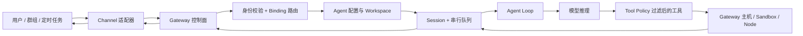

# Peter Steinberger：OpenClaw 核心产品与技术架构

- **日期**：2026-07-15（Asia/Shanghai）
- **研究阶段**：首期第 4 天
- **今日主题**：核心产品、OpenClaw 及相关技术架构
- **阅读时长**：约 10–15 分钟

## Executive Summary｜今日主题与核心判断

理解 OpenClaw，最容易犯的错误是把它看成“接入 WhatsApp、Telegram 的聊天机器人框架”。官方定义更准确：它是运行在用户设备上的个人 AI Assistant；Gateway 只是控制面，真正的产品是那个能够跨渠道接收请求、调用工具、操作设备、保留上下文并持续执行任务的助手。[1]

它的核心架构可以压缩为一句话：**一个长期运行的 Gateway，把渠道、身份、Agent、Session、模型、工具、设备节点和自动化连接成可路由、可观察、可治理的执行系统。** 渠道解决“从哪里收到和发回消息”，Agent 决定“由哪套身份、规则、模型与工具处理”，Session 保留“这次对话或任务的连续状态”，Tool 提供可调用动作，Skill 提供操作说明，Plugin 扩展运行时代码，Node 把能力延伸到另一台设备，Sandbox 与 Tool Policy 则约束动作发生在哪里、哪些动作根本不可见。[3][5][7][8][9][10][11][12][15]

Peter 的 Builder 路线也在这里完成收束。昨天分析的 CLI、MCP、Computer Use、远程终端和信息连接器，原本都是独立零件；OpenClaw 为它们提供长期进程、消息入口、会话状态、权限和反馈回路。它不是靠一种新模型建立差异，而是靠 **Harness Engineering**：把已有模型放进一个能在真实世界持续工作的系统。[1][2]

但能力和风险是同一枚硬币。OpenClaw 的主会话默认可以在宿主机上使用高权限工具；Workspace 只是默认工作目录，并不是安全沙箱；Skill 是 Prompt 级说明，也不是权限边界；Plugin 近似加载受信任代码；Node 一旦获批执行 `system.run`，就是远程执行面。因此，真正的安全顺序不能是“先写更强的系统提示词”，而应是身份准入、会话隔离、工具最小化、沙箱、执行审批、设备配对和独立信任边界。[6][10][11][12][13][14][15]

整篇的架构关键词链路是：Channel → Gateway → Binding → Agent → Session → Workspace → Model → Tool → Sandbox / Node → Channel。沿着这条链路阅读，比按功能清单理解更准确。

## Introduction｜研究范围与阅读方法

今天研究的是 2026-07-15 可见的 OpenClaw 当前架构，不复述安装教程，也不把 README 中所有功能逐项罗列。重点回答五个问题：产品究竟是什么；一条消息如何变成一次真实行动；Gateway、Agent、Session、Workspace、Tool、Skill、Plugin、Node 的边界分别在哪里；安全模型如何成立；这些设计如何体现 Peter 的 Builder 方法。

来源优先使用 OpenClaw 仓库、VISION、官方架构与安全文档，以及 Peter 2026 年 2 月的本人文章。OpenClaw 迭代极快，文档中已经出现 Worker、节点发布 Skills/MCP Tools、插件 Surface、Cron 条件触发器等快速扩展能力。本文把 Gateway、路由、会话、Agent Loop、工具和安全控制视为稳定主干；把更细的节点目录、插件生态和新调度能力视为正在扩展的外围，不把“已有文档”直接等同于“所有部署都已成熟使用”。

## Main Analysis｜核心产品与技术架构

### 一、产品不是 Gateway，也不是聊天窗口，而是“持续存在的个人执行者”

OpenClaw 的 README 有一句很关键的话：“Gateway is just the control plane — the product is the assistant.”[1] 这句话划清了产品层与基础设施层：Gateway 管连接、路由、状态和策略，但用户感受到的是一个一直在、知道上下文、能在不同入口继续工作、能够采取行动的助手。

传统聊天产品的基本闭环是“输入文本—生成文本”。OpenClaw 想做的闭环更长：用户从已有消息应用发出意图，系统确定是谁、来自哪个账户或群组、应该进入哪个 Agent 和 Session；Agent 组装 Workspace 规则、Skill 和历史上下文；模型决定是否调用工具；工具可以访问文件、浏览器、服务或配对设备；执行结果写回会话，再通过原渠道送达。[1][3][5][7][8]

因此，多渠道不是产品表面的“接入数量”，而是一种连续性设计。WhatsApp、Telegram、Slack、Discord、WebChat 或本地应用只是入口；真正需要保持一致的是背后的身份、路由、会话、权限和执行记录。Gateway 是把这些差异吸收掉的控制面。

Peter 本人把 OpenClaw 描述为最初用于学习 AI、做真实有用东西的 playground，后来才扩展为更大项目。2026 年 2 月，他进一步把目标表述为“连我妈妈也能用的 Agent”，同时强调这需要更安全、更广泛的系统性改变，并表示 OpenClaw 将进入基金会、保持开放和独立。[2][18] 这说明产品方向不是继续堆更多工程师功能，而是把高能力 Agent 变成普通人也能理解和控制的长期助手。

### 二、一条消息如何变成行动：OpenClaw 的主链路

这条链路有七个关键动作。

1. **Channel 接收并标准化消息。** 每个渠道负责自身登录、事件格式、附件、线程和发送语义，Gateway 则持有这些消息面的长连接或运行状态。[1][3]
2. **先做准入，再做模型推理。** DM pairing、allowlist、群组策略和 mention gate 决定这条输入是否有资格触发 Agent；它们不是 Prompt，而是在模型之前的硬入口。[13]
3. **Binding 决定由哪个 Agent 处理。** 多 Agent 模式可以按 channel、account、peer 等维度路由。最具体的匹配优先，使同一个 Gateway 可以承载私人助手、工作助手或隔离的 reader agent。[8]
4. **Session 决定上下文落在哪条连续轨道。** DM、群组、频道、Cron 和 Webhook 使用不同会话键或隔离策略。Gateway 持有 Session 状态，当前实现把每个 Agent 的运行时会话行放进独立 SQLite 数据库。[7]
5. **Agent Loop 串行完成一次运行。** 官方文档把它定义为 intake、上下文组装、模型推理、工具执行、流式回复和持久化的全过程；同一 Session 的运行会被串行化，并受全局队列控制，避免并发回复同时改写同一段对话状态。[5]
6. **只有过滤后仍可见的工具才交给模型。** Tool Profile、全局/Agent Policy、Provider Policy、Sandbox Policy、Channel 或 Plugin 条件会共同决定最终 Tool Schema。模型看不到被移除的工具，也就无法靠一句 Prompt 绕过工具策略。[9][15]
7. **结果持久化并按原路送达。** Tool lifecycle、assistant stream 和最终结果进入会话记录，再由 Gateway 选择正确的渠道与线程发送。[3][5][7]

这套流程的价值不在每个部件多新，而在于闭环完整。很多 Agent Demo 只展示步骤 5 和 6；OpenClaw 把步骤 1–4、7 以及长期运维也纳入产品。

### 三、十个核心概念：不要把相邻名词混成一件事

| 概念 | 它负责什么 | 它不是什么 |
| --- | --- | --- |
| Channel | 连接 WhatsApp、Telegram、Slack 等入口，收发消息、附件和线程 | 不是 Agent 的记忆或人格 |
| Gateway | 长期运行的控制面，持有渠道、路由、会话、协议、事件和策略 | 不是最终用户感知的全部产品 |
| Binding | 把 channel/account/peer 等入口确定性映射到 Agent | 不是权限本身，也不是 Session |
| Agent | 一套相对隔离的“脑”：Workspace、模型、认证、工具配置与会话空间 | 不是某一次对话，也不等于模型 |
| Session | 一条有生命周期的对话/任务连续轨道，保存上下文与运行状态 | 不是用户身份，不是授权令牌 |
| Workspace | Agent 的默认工作目录与长期文件上下文 | 不是硬沙箱 |
| Tool | 模型可调用的动作，如读写文件、浏览器、消息、Cron、Node | 不是使用说明 |
| Skill | `SKILL.md` 形式的操作知识、流程和使用说明 | 不是新增运行时代码，也不是权限边界 |
| Plugin | 向运行时增加 Tool、Channel、Provider、Hook、Skill 等能力 | 不是普通 Prompt；安装近似运行代码 |
| Node | 与 Gateway 配对的设备外设或远程执行主机 | 不是第二个 Gateway，也不自动等于第二个 Agent |

这些边界是理解 OpenClaw 的关键。[3][6][7][8][9][10][11][12] 尤其要记住三句：**Workspace 不等于 Sandbox，Skill 不等于 Tool，Node 不等于 Agent。** 一旦混淆，配置、安全审计和故障定位都会走错方向。

### 四、Gateway：单控制面的好处与代价

官方架构采用单个长期运行 Gateway：它拥有所有已连接消息面，控制端客户端和 Node 都通过 WebSocket 连接。默认本地地址是 `127.0.0.1:18789`，通常一台主机只运行一个 Gateway；远程访问推荐经 Tailscale 或 SSH，而不是直接暴露公网端口。[3]

协议不是松散事件流，而是有类型的控制面。第一帧必须是 `connect`；客户端声明 role、scope、能力和设备身份；之后使用 `req`、`res`、`event` 三类 JSON Frame。副作用方法要求 idempotency key，设备握手包含 challenge、签名和配对状态。[4] 这些细节说明 Gateway 同时是四种东西：

- **连接中心**：维护渠道、控制端与设备节点；
- **状态所有者**：掌握 Session、Presence、任务和运行事件；
- **路由器**：把入口映射到 Agent、Session 与回复目标；
- **策略执行点**：在 Tool、Node、Operator Scope 和 Sandbox 之前做硬判断。

单控制面的优势是所有入口共享一套事实来源，移动端、Web UI、CLI 和消息渠道不必各自保存一套会话真相。代价也明显：Gateway 是高价值故障点和高价值攻击面。官方安全模型明确把同一 Gateway 视为一个用户/信任边界，不支持互相敌对的多租户共享；真正不互信的用户应拆成独立 Gateway，最好再拆 OS 用户或主机。[13]

这是一项重要的产品诚实：OpenClaw 可以在一个 Gateway 内运行多个隔离 Agent，但这种“隔离”主要是配置、Workspace、认证和 Session 的逻辑隔离，不等于面向敌对租户的强安全隔离。[8][13]

### 五、Agent、Session、Workspace：连续性的三层结构

**Agent 是配置与身份边界。** 多 Agent 文档说明，每个 Agent 可以有自己的 Workspace、`agentDir`、模型认证和 SQLite 会话历史；Binding 决定入口进入哪个 Agent。[8] 这适合把个人、工作、只读资料处理器或不同家庭成员的助手分开，但前提是继续为每个 Agent 配置不同工具和沙箱策略。

**Session 是时间与对话边界。** 每条入站消息根据来源落入 Session。默认单用户场景下，不同 DM 可以共享主 Session 以保持跨设备连续性；一旦多个人能发 DM，就应改成 `per-channel-peer` 等隔离模式，否则不同人的内容可能进入同一上下文。[7][13] Session 还处理每日/闲置重置、压缩、队列、历史和维护，它是“这次持续工作到哪里”的载体。

**Workspace 是长期文件上下文。** `AGENTS.md`、`SOUL.md`、`USER.md`、`TOOLS.md`、`HEARTBEAT.md`、每日记忆、长期 `MEMORY.md` 和 Workspace Skills 都可以存在其中。[6] 它很接近 Agent 的家和长期认知环境，但官方文档特意警告：Workspace 只是默认 cwd；未启用 Sandbox 时，绝对路径仍可访问宿主机其他位置。[6]

这个三层拆分很有启发：人格与长期规则放 Agent/Workspace，某次对话的短期连续性放 Session，真正能否执行某个动作则交给 Tool Policy 和运行环境。不要期待一个 `AGENTS.md` 同时承担记忆、路由、授权和隔离。

### 六、Tool、Skill、Plugin：能力、知识与代码必须分层

OpenClaw 文档对三者的区分非常明确：Tool 是模型可调用动作；Skill 教 Agent 如何工作；Plugin 为运行时增加 Tool、Provider、Channel、Hook、Skill 等能力。[9][10][11]

**Tool 是硬能力面。** 它有名称和 Schema，最终 Tool 列表会在模型调用之前经过多层策略过滤。`deny` 优先于 `allow`；如果 `exec` 仍被允许，仅仅禁掉 `write`、`edit` 并不能阻止 Shell 改文件，因为 Tool Policy 按工具名治理，不能理解 `exec` 内部每条命令的副作用。[15]

**Skill 是上下文工程。** 它用 Markdown 告诉 Agent 什么时候、为什么、以何种步骤使用现有工具。Workspace Skill 在同名冲突时优先级最高，适合让某个 Agent 拥有私有工作流。[10] 但 Skill allowlist 或可见性不是 Shell 授权；`SKILL.md` 里写“只能读”也不会自动让底层工具变成只读。

**Plugin 是受信任扩展代码。** 当前插件系统可以增加渠道、模型 Provider、Agent Harness、Tool、Skill、语音、搜索和 Hook。官方文档明确要求把安装 Plugin 当作运行代码，优先固定版本并审查来源。[11] VISION 还说明 OpenClaw 正在让 Core 变瘦、把可选能力移到 Plugin；能用 Bundle-style Plugin 表达时，优先于更深的 Code Plugin，因为接口更稳定，安全边界也更好。[2]

这套分层反映了 Peter 熟悉的产品策略：核心只保留稳定编排与治理，能力通过可替换接口扩张，操作经验通过文本快速迭代。好处是生态可以非常快；代价是供应链、版本兼容、权限漂移和插件质量会成为新的系统成本。

### 七、Node：把“我的设备”变成 Agent 的执行边缘

Node 是 OpenClaw 最能体现“个人 Agent”而非“云端 Chatbot”的设计。手机、Mac、Windows 或无界面的 Node Host 与 Gateway 使用同一 WebSocket 协议连接，但声明 `role: node` 和显式能力/命令。官方定义强调：Node 是 peripheral，不运行 Gateway，渠道消息仍然先到 Gateway。[3][4][12]

Node 可以提供 Canvas、相机、屏幕、定位、通知、语音，或在另一台机器上执行 `system.run`。当 Gateway 在服务器、但操作必须发生在家中 Mac 时，模型仍在 Gateway 一侧运行，Gateway 把批准后的调用转发给 Node Host；执行审批保存在 Node 侧。[12]

这里有两层容易误判的信任。第一，设备配对确认“这台设备可以作为 Node 加入”，但高风险命令还要经过 Gateway command allowlist 和 Node 本地 exec approval。第二，配对不是每条命令的人工复核；一旦策略允许 `system.run`，它本质上就是远程代码执行面。[12][13]

从产品角度看，Node 把 Peter 之前的 Peekaboo、VibeTunnel 和原生端经验连接起来：Agent 不仅能调用 Web API，还可以看到并操作用户实际拥有的设备。它显著扩大了可用性，也把操作系统权限、设备在线状态、网络连接与本地审批带进系统设计。

### 八、Cron 与 Heartbeat：让 Agent 从“被问才答”变成“持续工作”

OpenClaw 内建 Cron 调度器，由 Gateway 保存任务、在指定时间唤醒 Agent 或执行命令，并把结果发回渠道。隔离 Cron 每次创建新 Session，适合日报、后台整理和定时研究；主 Session 事件更像提醒；自定义持久 Session 则适合需要跨多次运行累积上下文的工作流。[16]

Heartbeat 更适合周期性、可合并、依赖当前上下文的检查；Cron 更适合精确时间、独立模型/工具配置和明确交付目标。[17] 这两个机制补足了个人 Agent 的时间维度：它不仅响应消息，也能在用户没有输入时继续观察、整理和汇报。

但自动化也会放大权限。无人值守的 Agent Turn 仍会继承目标 Agent 的 Tool Policy；条件触发脚本甚至可能拥有 `exec`。所以定时任务不应只定义“什么时候运行”，还要同时定义“用哪个 Agent、哪个 Session、哪些 Tool、写到哪里、是否允许外发、失败如何告警”。[16]

### 九、安全模型：Prompt 不是墙，安全来自分层缩小爆炸半径

OpenClaw 的安全文档没有宣称 Prompt Injection 已被解决。相反，它明确说系统提示词只是软指导；硬约束来自 Tool Policy、Exec Approval、Sandbox 和 Channel Allowlist。即使只有本人可以发消息，网页、邮件、附件和代码也可能携带恶意指令，因此“不公开 DM”不等于“没有 Prompt Injection”。[13]

可以把安全链条理解为六层：

1. **身份准入**：DM pairing、allowlist、群组白名单与 mention gate；
2. **上下文隔离**：多用户 DM 按 peer/channel 分 Session，敏感工作拆不同 Agent；
3. **能力最小化**：只向模型暴露任务需要的 Tool，特别限制 `exec`、browser、web、message、cron 与 node；
4. **执行位置隔离**：Sandbox 决定 Tool 在容器/隔离后端还是宿主机运行，并控制 Workspace 的 `none`、`ro`、`rw` 访问；
5. **高风险审批**：Exec Approval、Node command allowlist、设备权限和 elevated sender allowlist；
6. **信任边界拆分**：真正敌对或互不信任的用户使用独立 Gateway、OS 用户或主机。[13][14][15]

还要分清三个配置维度：Sandbox 决定**在哪里运行**；Tool Policy 决定**哪些工具存在**；Elevated 只是已启用 `exec` 时的**越出沙箱通道**，它不会授予新工具，也不能覆盖 Tool deny。[15]

官方默认偏向“可信单用户的高能力助手”：主 Session 的工具可能直接在宿主机运行，而非主群组/频道才进入 Sandbox。[1][15] 这种默认值符合个人生产力产品，但不适合直接复制到公开机器人或企业多租户系统。能力越强，越要按入口拆 Agent、按任务缩 Tool、按数据拆 Workspace，并把外部资料先交给只读 Reader Agent。

### 十、Peter 的架构风格：把复杂度放进接口，而不是要求用户理解底层

OpenClaw 延续了 Peter 多年来的稳定风格：先把底层复杂机制包成调用者能理解的接口。早期 PSPDFKit 把复杂 PDF 能力变成移动开发者可用 SDK；PSTCollectionView 对齐熟悉的 UIKit API；MCPorter 把 MCP Tool 变成类型化接口；Peekaboo 把 macOS GUI 变成 CLI/MCP；现在 Gateway 再把渠道、协议、Session 与设备统一成一个控制面。

这套架构最重要的不是“全都自己造”。相反，它大量依赖现成模型、消息平台、WebSocket、SQLite、Docker、原生权限和插件；Peter 的贡献集中在边界设计、产品闭环和可操作性。VISION 也把 OpenClaw 定位为编排系统，主要处理 Prompt、Tool、Protocol 和 Integration，而不是发明新的模型训练栈。[2]

但 OpenClaw 也暴露了高速 Builder 的典型张力：功能面迅速变大后，Gateway 会承担越来越多控制面责任；Plugin、Node、MCP、Cron 与多 Agent 的组合状态成倍增长；安全配置只有在用户理解信任模型时才真正有效。项目当前把“Security and safe defaults、Bug fixes and stability、Setup reliability”列为首要优先级，正说明下一阶段的难点不再是证明 Agent 能做事，而是让它稳定、可理解、可恢复地做事。[2]

## Claims-Evidence Table｜关键判断与证据

| 关键判断 | 主要证据 | 置信度 |
| --- | --- | --- |
| OpenClaw 的产品是持续工作的个人助手，Gateway 是控制面 | README 的明确定位与 Gateway 架构文档一致 [1][3] | 高 |
| 单 Gateway 统一持有渠道、路由、会话和节点连接 | 架构与 WebSocket 协议文档交叉支持 [3][4] | 高 |
| Agent、Session、Workspace 分别承担配置身份、短期连续性和文件上下文 | Workspace、Session、多 Agent 文档 [6][7][8] | 高 |
| Skill 不是权限，Workspace 不是沙箱，Node 不是 Gateway | 三份官方文档均有直接边界说明 [6][10][12] | 高 |
| OpenClaw 的核心差异是 Harness 与系统闭环，而不是新模型算法 | README、VISION、Agent Loop 与本文对组件组合的分析 [1][2][5] | 中高；“核心差异”属于综合判断 |
| 高能力与高风险来自同一套工具和设备执行面 | Tool、Node、安全与沙箱策略文档 [9][12][13][14][15] | 高 |
| 项目正在从个人 Playground 转向更安全、稳定和可普及的平台 | VISION 的当前优先级与 Peter 本人 2026 年声明 [2][18] | 高 |

## Counterevidence Register｜反证与不同解释

第一，“本地优先”不等于“完全离线”或“数据绝不出设备”。Gateway、Workspace 和很多执行面可以在本地，但模型 Provider、消息渠道、搜索、语音和插件可能是外部服务。实际数据边界取决于所选模型、Channel、Tool 与 Plugin，不能由产品口号直接推导。[1][2]

第二，“多 Agent 隔离”不是敌对多租户安全。不同 Agent 拥有独立 Workspace、认证和 Session 是很有价值的逻辑隔离，但官方安全范围仍是一个 Gateway 对应一个信任边界；如果宿主机或 Gateway 配置被共同控制，Agent 分目录并不能提供强租户隔离。[8][13]

第三，“启用 Sandbox”不代表所有风险消失。错误的 bind mount、读写 Workspace、允许网络或 `exec`、开放 Elevated，都可能重新扩大权限；Tool Policy 与 Sandbox 还必须一起配置。[14][15]

第四，README 和官方文档主要描述设计意图与当前接口，不等同于独立安全审计或生产可靠性证明。本文没有执行渗透测试、故障注入、长期负载测试，也没有系统抽样 Issue，因此不能从文档完整度推导出实现不存在缺陷。

第五，单 Gateway 的集中化既能减少状态分裂，也会扩大单点影响。如果需要跨地区高可用、严格企业租户隔离或合规审计，OpenClaw 当前的个人助手架构未必是最佳起点。[3][13]

## Synthesis｜Builder 方法与思维方式

今天可以把 Peter 的 OpenClaw 方法总结成四层。

第一层是 **从高频入口出发**。用户已经在 WhatsApp、Telegram、Slack 和手机上生活，产品不要求他们先学一个新工作台，而是把 Assistant 放进现有渠道。[1]

第二层是 **建立统一控制面**。所有客户端、Node、Session 和 Tool 由 Gateway 统一路由和观察，避免每个 UI 各自保存一套真相。[3][4]

第三层是 **把能力拆成可组合接口**。模型不是系统本身；Tool 承担动作，Skill 承担知识，Plugin 承担运行时扩展，Node 承担设备边缘，Binding 和 Session 承担连续性。[7][8][9][10][11][12]

第四层是 **用硬边界约束软智能**。Prompt 可以指导，但身份、Tool、Sandbox、Approval 和独立 Gateway 才决定爆炸半径。[13][14][15]

这是一种很典型的 AI Builder 视角：不等待模型变成万能智能，而是重新设计模型周围的环境，让它能观察、调用、验证、记住和恢复。Peter 的强项不是把每个模块做到理论上最复杂，而是找到能闭合真实任务的最小接口，然后快速把接口连接成产品。

## Limitations｜限制与仍待验证的问题

本篇主要使用官方与本人一手来源，适合确认系统自我定义、组件接口和设计意图，但外部批评与独立测评不足。安全结论只说明官方模型如何设计，不代表本文完成了安全审计。

OpenClaw 文档与代码在 2026 年仍快速变化。Gateway Protocol、Plugin、Node、Cron 与 Session 已出现比早期版本更复杂的能力，后续版本可能调整默认值、存储路径、Tool 名称和权限规则。本文所有链接访问于 2026-07-15，引用具体配置前应重新查阅当前文档。

本文也没有从源码逐函数追踪一条消息的调用栈，没有在真实 Gateway 中抓取事件流，更没有比较不同模型、渠道和 Sandbox Backend 的运行差异。因此“主链路”是基于官方文档的架构级还原，不是性能剖析或实现级审计。

## Recommendations｜对用户的具体启发

第一，如果你要构建自己的个人 Agent，不要从“聊天 UI”开始，先画清一条任务闭环：入口是谁、如何鉴权、路由到哪个 Agent、上下文存在哪里、允许哪些 Tool、结果发到哪里、失败怎样恢复。缺任一环，Demo 都很难成为长期系统。

第二，明确区分三类扩展。新动作做成 Tool，新操作方法做成 Skill，需要运行时 Hook、Provider 或 Channel 才做 Plugin。能用 Skill 解决时不要写 Plugin，能用受限 Tool 解决时不要开放通用 `exec`。

第三，为不同风险面拆 Agent。主 Agent 可以服务私密高信任任务；读取网页、邮件和附件的 Reader Agent 应只读、禁 `exec`、禁外发；公开群组使用独立 Session、严格 allowlist 和 Sandbox。不要让“方便共享上下文”覆盖信任边界。

第四，把 Workspace 当私密记忆仓库，但不要把它误当沙箱。把凭据放在受控配置或 Secret Store，不写入 Workspace；对自动化任务只授予需要的目录和工具。

第五，设计 Node 或 Computer Use 时采用“双重同意”：Gateway 决定是否允许调用该命令，设备本地再决定是否批准执行；对相机、屏幕、通讯录、消息发送和 Shell 分别设置权限，不要只依赖一次配对。

第六，定时任务要同时写出时间策略与权限策略。精确定点报告用 Cron，周期性批处理用 Heartbeat；每个任务固定 Agent、Session、Tool 集、输出目录、交付目标和失败通知。长期自动化首先是权限与可观察性问题，其次才是 Prompt 问题。

第七，评估 Agent 产品时少看“支持多少模型/渠道”，多看五个指标：会话是否可恢复；工具是否可最小授权；失败是否可观察；外部输入是否被隔离；设备动作是否有本地审批。这些才决定它能否从演示走向日常使用。

## Bibliography｜来源清单

[1] OpenClaw Contributors（2026），[OpenClaw — Personal AI Assistant](https://github.com/openclaw/openclaw)，访问于 2026-07-15。  
[2] OpenClaw Contributors（2026），[OpenClaw Vision](https://github.com/openclaw/openclaw/blob/main/VISION.md)，访问于 2026-07-15。  
[3] OpenClaw Documentation（2026），[Architecture](https://docs.openclaw.ai/concepts/architecture)，访问于 2026-07-15。  
[4] OpenClaw Documentation（2026），[Gateway Protocol](https://docs.openclaw.ai/gateway/protocol)，访问于 2026-07-15。  
[5] OpenClaw Documentation（2026），[Agent Loop](https://docs.openclaw.ai/concepts/agent-loop)，访问于 2026-07-15。  
[6] OpenClaw Documentation（2026），[Agent Workspace](https://docs.openclaw.ai/concepts/agent-workspace)，访问于 2026-07-15。  
[7] OpenClaw Documentation（2026），[Session Management](https://docs.openclaw.ai/concepts/session)，访问于 2026-07-15。  
[8] OpenClaw Documentation（2026），[Multi-Agent Routing](https://docs.openclaw.ai/concepts/multi-agent)，访问于 2026-07-15。  
[9] OpenClaw Documentation（2026），[Tools](https://docs.openclaw.ai/tools)，访问于 2026-07-15。  
[10] OpenClaw Documentation（2026），[Skills](https://docs.openclaw.ai/tools/skills)，访问于 2026-07-15。  
[11] OpenClaw Documentation（2026），[Plugins](https://docs.openclaw.ai/tools/plugin)，访问于 2026-07-15。  
[12] OpenClaw Documentation（2026），[Nodes](https://docs.openclaw.ai/nodes)，访问于 2026-07-15。  
[13] OpenClaw Documentation（2026），[Security](https://docs.openclaw.ai/gateway/security)，访问于 2026-07-15。  
[14] OpenClaw Documentation（2026），[Sandboxing](https://docs.openclaw.ai/gateway/sandboxing)，访问于 2026-07-15。  
[15] OpenClaw Documentation（2026），[Sandbox vs Tool Policy vs Elevated](https://docs.openclaw.ai/gateway/sandbox-vs-tool-policy-vs-elevated)，访问于 2026-07-15。  
[16] OpenClaw Documentation（2026），[Cron Jobs](https://docs.openclaw.ai/automation/cron-jobs)，访问于 2026-07-15。  
[17] OpenClaw Documentation（2026），[Cron vs Heartbeat](https://docs.openclaw.ai/automation/cron-vs-heartbeat)，访问于 2026-07-15。  
[18] Peter Steinberger（2026-02-15），[OpenClaw, OpenAI and the Future](https://steipete.me/posts/2026/openclaw)。

## Methodology｜方法说明

本次先以 Asia/Shanghai 确认研究日期，再检索 OpenClaw 官方文档和当前 GitHub 主分支，围绕 Gateway、Protocol、Agent Loop、Workspace、Session、Multi-Agent、Tool、Skill、Plugin、Node、Security、Sandbox 与 Automation 建立概念矩阵。研究档案登记 18 个一手来源和 18 条证据，并为架构、安全和 Peter 本人目标分别保留证据。

事实判断尽量使用官方直接说明；“Harness Engineering 是核心差异”“这些零件在 OpenClaw 中收束”等属于本文综合判断，已与事实描述区分。安全部分同时登记了反证：本地优先不等于离线、多 Agent 不等于敌对租户隔离、Sandbox 不等于绝对安全。报告完成后通过结构、引用可解析性和 Claim–Evidence 支持检查；动态接口与默认值均标记访问日期。

## 明日预告

明天将研究 Peter 的个人工作流、AI 编程方式与工具使用：他如何分配不同 Coding Agent、怎样使用 CLI-first 与 Model-first 原型、为什么不再逐行阅读全部生成代码，以及他的高速度方法在哪些场景值得借鉴、哪些场景不应照搬。
