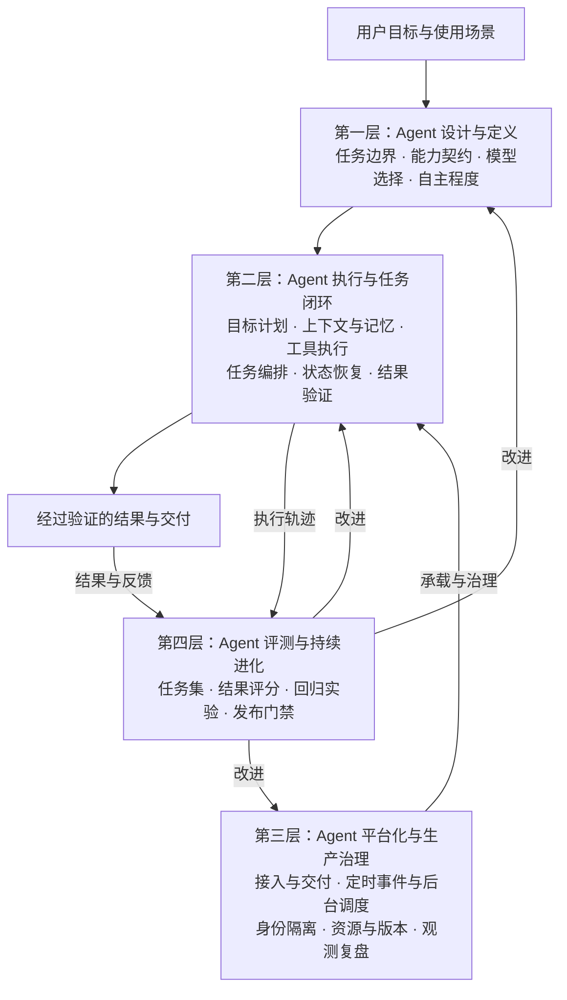
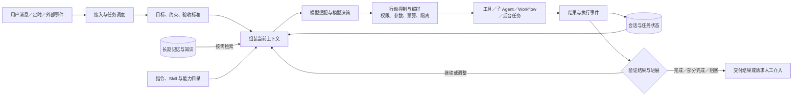

# Harness 架构总览：从模型能力到可靠任务系统

本文整理用户本次口述，并补充工程边界。它是四层知识体系的总地图，不是独立课题正文，也不是行业统一标准。以下架构属于设计建议；文末官方资料仅支持对应概念，不表示 Claude Code、Codex 或 DeepSeek Harness 已实现图中全部能力。

## 核心定义

模型提供理解、推理和生成能力；Harness 围绕模型组织信息、执行行动、维护状态、控制边界、验证结果，让 Agent 能持续完成任务。

模型可以生成结构化工具调用请求，但读取文件、启动进程、访问网络等动作由模型外部的软件执行。供应商托管工具同样存在这层执行系统。

本体系采用宽口径：执行循环是 Harness 的核心，调度、接入、治理与评测共同构成完整 Agent 工程体系。它们可以由外部平台提供，无须全部塞进一个 Runtime。

## 一、沿着需求推导能力

| 遇到的问题 | 长出的能力 | 需要研究的核心问题 |
| --- | --- | --- |
| 模型无法自己操作外部环境 | 基础工具与执行环境 | 如何读取、搜索、修改、运行，以及限制行动范围？ |
| 工具越来越多，方法难以复用 | 能力组织与扩展 | Tool、Skill、MCP、Connector、Plugin 各管什么？ |
| 调一次模型不足以完成任务 | Agent Loop | 如何把行动结果反馈给模型，决定继续、调整或停止？ |
| 用户需求可能含糊，执行容易跑偏 | 目标、约束、计划与验收 | 要达到什么状态，允许做什么，怎么证明做完？ |
| 对话和工具输出越来越长 | 上下文工程 | 当前请求该放什么，如何控制体积并保持信息质量？ |
| 任务跨轮、跨天甚至跨进程 | 状态持久化与长期记忆 | 当前任务如何接续，历史经验如何按需召回？ |
| 独立探索占满主上下文 | Subagent 与协作 | 如何委派、隔离、交接、验收与合并结果？ |
| 重复流程无须每步重新推理 | Workflow | 哪些步骤交给代码，哪些节点需要模型自主判断？ |
| 工作太久，前台不能一直阻塞 | 后台与异步任务 | 谁持有任务，如何等待、取消、恢复和通知？ |
| 没有人发消息也要开始工作 | 定时与事件触发 | 什么事件唤醒任务，结果发给谁，如何避免重复？ |
| 不同模型和供应商行为不同 | 模型与协议适配 | 如何表达能力差异、预处理输入、切换与降级？ |
| 工具能改动真实世界 | 权限、安全与人工协作 | 如何落实授权、隔离不可信输入、约束副作用？ |
| 进程、网络、外部服务会失败 | 恢复与一致性 | 如何继续未完成任务而不重复造成业务效果？ |
| 多人同时使用，资源有限 | 平台治理 | 如何隔离身份、管理队列、成本、容量与版本？ |
| 运行异常需要排查 | 全链路观测与复盘 | 哪一步失败，模型看到了什么，外部结果是什么？ |
| 改动之后需要证明真的变好 | 评测与持续进化 | 如何把生产失败转成回归案例并控制发布风险？ |

这是学习与需求推导顺序，不是严格的实现依赖链。权限、验证和状态应在最小可用系统中就出现；长期记忆并不以先完成压缩为前提。

## 二、四层知识架构

四层是知识责任划分，不是四个必须按顺序调用的软件服务。安全、状态、成本和可观测性会贯穿各层。

### 第一层：Agent 设计与定义——要造什么，边界在哪里？

| 领域 | 收纳的知识 | 首要决策 |
| --- | --- | --- |
| 1. 任务定位与成功契约 | 通用/垂直 Agent、用户场景、能力边界、输入输出、成功标准 | 哪些任务交给 Agent，哪些拒绝、转交或交给确定性程序？ |
| 2. 能力组织与扩展契约 | System Prompt、Tool、Skill、MCP、Connector、Plugin、发现与版本 | 什么能力暴露给模型，如何复用、接入、按需加载？ |
| 3. 模型能力与适配契约 | Provider、工具协议、结构化输出、多模态、上下文限额、路由 | 如何选择模型，并明确各模型真正支持的能力与限制？ |
| 4. 自主程度与安全策略 | 身份、授权、风险分级、确认条件、预算、数据边界 | Agent 可以自行决定和执行到什么程度？ |

### 第二层：Agent 执行与任务闭环——怎样可靠地做完一件事？

| 领域 | 收纳的知识 | 首要决策 |
| --- | --- | --- |
| 5. 目标、计划与执行循环 | Goal、ReAct、Plan-and-Execute、动态重规划、停止条件 | 下一步是否服务于目标，何时继续、调整、求助或停止？ |
| 6. 上下文工程 | 请求组装、信息筛选、按需加载、工具结果裁剪、压缩、来源标记 | 每次调用模型时，它到底需要看到什么？ |
| 7. 长期记忆与知识召回 | 记忆写入、文件/关键词/向量检索、重排、更新、遗忘、来源冲突 | 记什么、怎么找、找到后如何判断和使用？ |
| 8. 工具运行与行动控制 | Read/Write/Edit、文件搜索、Shell、Web、浏览器、参数校验、Sandbox | 如何把调用意图变成受控、可追踪的真实行动？ |
| 9. 任务编排与协作 | Subagent、Workflow、串并行、依赖、委派契约、结果汇总 | 什么由主 Agent 做，什么委派，什么固定为程序？ |
| 10. 会话、状态与恢复 | Session、任务状态、事件、Checkpoint、中断、取消、恢复、幂等 | 已经发生了什么，哪里可以继续，什么动作不能盲目重做？ |
| 11. 验证、交付条件与人工协作 | 结果检查、证据、目标偏离、审批、用户纠偏、部分完成 | 怎么证明任务完成，不能证明时如何收敛？ |

### 第三层：Agent 平台化与生产治理——怎样持续提供服务？

| 领域 | 收纳的知识 | 首要决策 |
| --- | --- | --- |
| 12. 接入与可靠交付 | API、聊天渠道、外部调用、流式事件、文件产物、消息路由 | 请求属于谁，最终结果能否送达正确对象？ |
| 13. 触发、调度与后台运行 | 定时器、Webhook、事件队列、Worker、后台任务、完成唤醒、通知 | 谁启动任务，谁持有长任务，完成后如何继续或通知？ |
| 14. 多租户、资源与发布治理 | 身份/工作区隔离、凭证、并发、排队、成本、限流、灰度、回滚 | 多人、多实例、多版本情况下如何稳定、可控地运行？ |
| 15. 全链路观测与故障复盘 | 日志、指标、Trace、实际请求、工具事件、后台链路、交付结果 | 能否从失败结果还原原因，区分模型、运行时、工具与业务失败？ |

### 第四层：Agent 评测与持续进化——怎样知道它变好了？

| 领域 | 收纳的知识 | 首要决策 |
| --- | --- | --- |
| 16. 评测与实验体系 | 真实任务集、验收器、多次试验、压缩/记忆/恢复/协作专项评测 | 成功率、稳定性、成本、延迟和安全边界有没有改善？ |
| 17. 生产反馈与改进闭环 | 用户反馈、Bad Case、最小复现、版本归因、回归集、发布门禁 | 如何把一次失败变成以后持续防止同类失败的资产？ |

## 三、运行时各部分怎样配合

图中异步动作不会要求模型持续占用一次请求等待：任务进入等待状态，调度系统在事件到达后安排后续执行。日志、权限、资源控制与版本记录贯穿流程，未全部画成箭头。

## 四、必须分清的边界

### Tool、Skill、MCP、Plugin

- Tool 负责一次可执行动作及其结果契约。
- Skill 提供可复用的方法、知识、资源和可选脚本。文件式 Skill 需要读取或加载入口，脚本执行才需要相应执行能力；不要求工具一定名为 `read`，也不是每个 Skill 都需要 Shell。
- MCP 作为外部能力接入协议使用；Connector 负责具体系统的接入适配；二者和 Skill 可以组合。
- Plugin 在本体系中指能力的打包、安装与分发单元，具体包含什么由宿主定义。

增加 Skill 不会自动消除所有工具适配工作。Shell/CLI 可以覆盖大量通用操作，但凭证、运行环境、结果协议和受控业务接口仍需设计。

Agent Skills 的官方定义是指令、脚本和资源包，并通过发现、激活、按需加载来工作：[Agent Skills 官方概览](https://agentskills.io/home)。

### 上下文、任务状态、长期记忆

| 概念 | 主要回答 | 例子 |
| --- | --- | --- |
| 上下文 | 模型这一轮看到了什么？ | 当前目标、近期消息、工具结果、召回片段 |
| 任务状态 | 任务实际上进行到了哪里？ | 已完成步骤、待办、外部任务 ID、已发生的发送动作 |
| 长期记忆 | 历史上哪些信息值得再次使用？ | 用户偏好、项目约定、历史决策、经验 |

压缩管理当前工作信息；长期记忆管理可复用历史。是否隔了一天不是二者的边界。持久化后的会话可以跨天恢复；当天的新会话也可能需要长期记忆。

压缩应保留目标、约束、已完成事项、未完成事项、关键证据引用、已发生副作用和不确定状态。关键任务事实应有独立持久记录，不只依赖自然语言摘要。

记忆沿用用户提出的三个问题：**记什么、怎么找、找到后如何加权使用**。其中加权不仅指相似度，还包括相关性、来源可靠性、时效性和与当前要求是否冲突；另需处理修正、删除和失效。

压缩、结构化笔记和子 Agent 是可组合的上下文管理方法，参见 [Anthropic 上下文工程](https://www.anthropic.com/engineering/effective-context-engineering-for-ai-agents)。

### Subagent、Workflow、后台任务、定时任务

| 机制 | 核心维度 |
| --- | --- |
| Subagent | 谁负责一个相对独立的目标，以及它的上下文和权限边界 |
| Workflow | 步骤和依赖如何组织，哪些约束由程序保证 |
| 后台任务 | 如何脱离前台等待，由运行系统管理生命周期 |
| 定时任务 | 何时由时间条件触发一次执行 |

四者可以叠加：每天定时启动 Workflow，其中某一步并行委派 Subagent，整个流程作为后台任务运行。

Workflow 的“动态”要继续细分：生成流程、选择已有流程、运行时调整分支是不同课题。让 Agent 生成脚本只是构建流程的一种方式；可靠 Workflow 还需要输入输出契约、状态、重试与版本。调度是独立责任。

Subagent 并不天然省 Token。它能隔离局部上下文，但重复上下文和结果整合也可能增加总成本；文件、外部系统和记忆仍可能共享，需要另行控制。

### 计划、目标与验收

目标表达要达到的结果，计划表达当前路径，验收检查实际证据。计划可以调整；目标和授权范围不能随着重规划而悄悄改变。ReAct 与计划执行可以组合，不能只按是否列出计划来分类。

### 模型特性与平台适配

模型适配既包含模型本身的能力，也包含供应商和网关的协议限制。应分别记录图片尺寸、图片数量、载荷大小、编码格式、上下文限制以及工具调用语义。

用户口述的“Opus 4.6 图片长边最大 1546”不作为已确认事实。2026-09-05 核验的官方文档把标准分辨率档长边写为 **1568 px**，并区分原生处理分辨率、缩放行为与请求接收限制；不能把它直接等同于上传硬上限。具体工具结果还可能具有不同处理规则：[Claude Vision 官方文档](https://platform.claude.com/docs/en/build-with-claude/vision)。数值会变，知识主干应保留“能力声明、请求前校验与输入适配”这一责任。

## 五、用一个任务串起来

下面是说明性设计案例，不代表已经部署的自动化。

任务：每天早上 8 点查找 AI 工程动态，挑选与用户关注方向有关的内容，形成带来源的摘要并通知用户。

1. 设计层规定来源范围、时间范围、筛选标准、交付渠道和授权。
2. 调度层按时区触发，生成可去重的任务标识。
3. 运行层加载用户关注方向和必要历史，避免每天重发相同内容。
4. 固定抓取、去重和格式检查交给程序；相关性判断和摘要交给模型节点。
5. 独立而耗时的研究可委派 Subagent；长任务由后台执行系统持有。
6. 保存抓取进度、候选结果、证据引用与发送状态，重启后可接续。
7. 交付前核验来源、日期和摘要事实；信息不足时明确表达不确定性。
8. 通过渠道发送，单独记录内容生成结果与发送结果。
9. 网络中断后先查询或核对发送状态，再决定是否重试，避免重复通知。
10. 将漏报、过期内容和用户反馈纳入后续评测。

同一任务由此把工具、Skill、上下文、记忆、编排、异步、定时、状态、安全、验证、观测和评测连接起来。

## 六、以后怎样往框架中补充内容

每个新知识点先回答四个问题：它解决哪种失败？主责任属于哪一层、哪个领域？输入输出与其他机制的边界是什么？怎样验证有效？

- 新材料先挂到一个主领域，再链接关联领域，避免重复正文。
- 本总览维护稳定责任与问题；模型参数和具体版本放进对应专题，注明核验日期。
- 专题达到可讨论初稿后，使用根目录的 [课题写作模板](课题写作模板.md) 落盘。
- 源码研究以 Claude Code、Codex、DeepSeek Harness 为主；本文没有新增三者的未核验实现结论。
- 学习顺序可以沿第一节展开，文件归属仍保持四层。
- 完整知识体系意味着能解释这些责任；具体产品按任务需要选择实现规模，无须从第一天搭齐全部模块。

关联入口：[知识体系索引](知识体系索引.md)、[核心术语表](核心术语表.md)。
